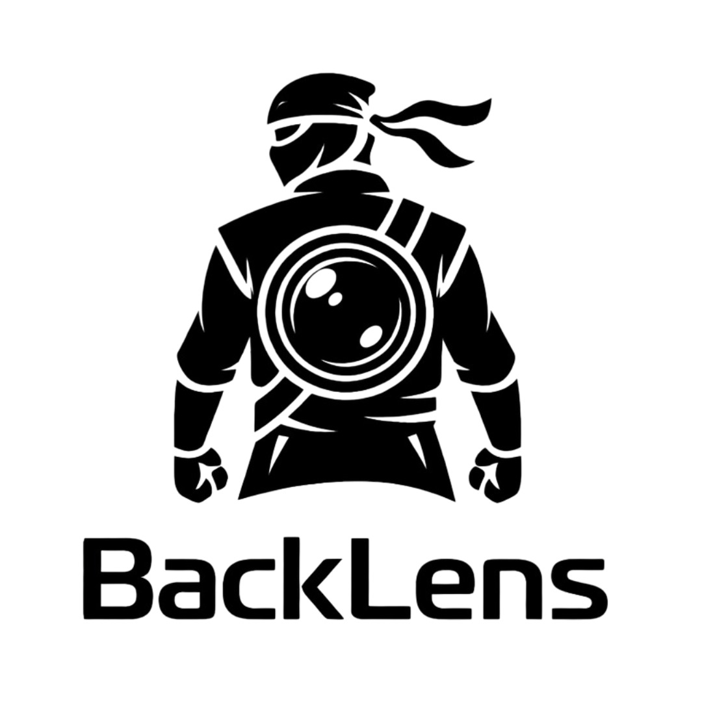
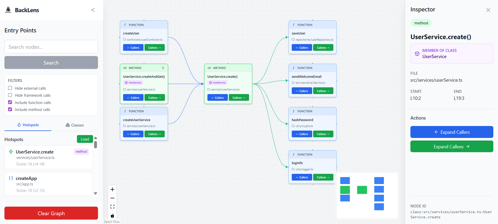
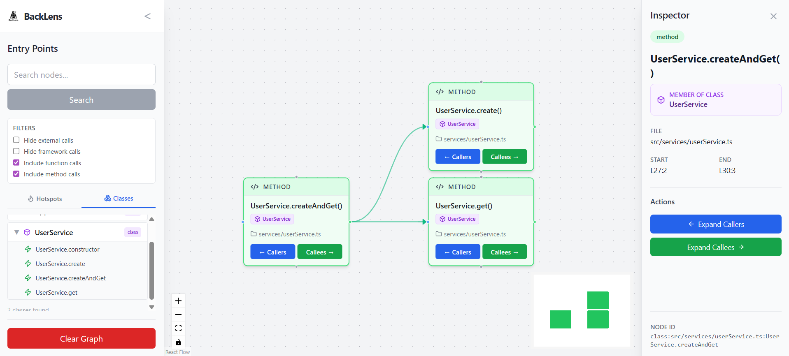
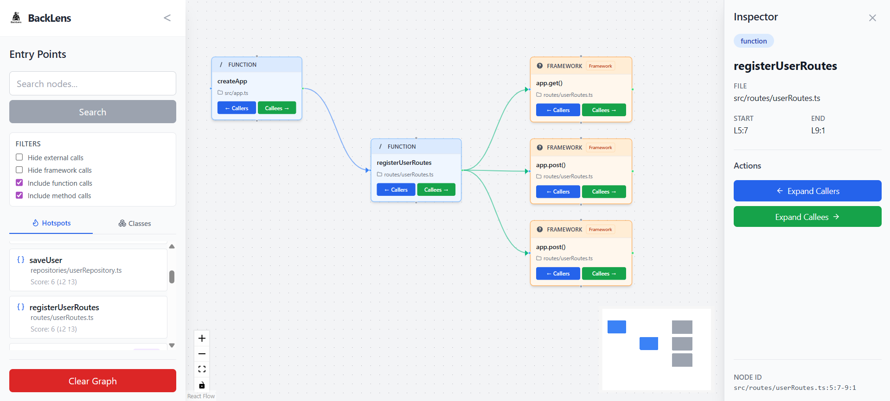



   <picture>
      <source media="(prefers-color-scheme: dark)" srcset="docs/assests/whiteLogo.png" />
      
   </picture>

# BackLens

BackLens helps you explore codebases as a semantic call graph inside VS Code and on the web.

## What is BackLens?
BackLens is a static code intelligence platform for backend-oriented codebases.

It analyzes source code, builds a call graph, stores it in SQLite, and lets you explore architecture through:

- a standalone web app
- a VS Code extension webview

## Why should you care?
BackLens helps you:

- understand unfamiliar backend code faster
- trace call chains between functions, methods, and classes
- inspect architectural hotspots
- jump from graph nodes directly to source

## Why use it?
BackLens helps you quickly answer practical architecture questions:

- What calls this function or method?
- What does this class depend on?
- Which nodes are hotspots?
- How do I jump from graph node to source?

It is designed for understanding unfamiliar repositories and reducing time spent tracing call flows manually.

## Features
- JS/TS parser with object-aware extraction (functions, classes, methods, calls)
- Graph-store query engine with transitive traversals, hotspots, and path queries
- Core REST API for graph operations
- Interactive 3-panel web UI (search, hotspots, inspector, expansion)
- VS Code extension with project registry, analysis pipeline, graph view, and source navigation

## Demo / Screenshots
Current UI snapshots:

### Hotspots and Method Expansion

### Class Hierarchy and Inspector

### Framework Call Graph View

### Go-to-Source Navigation (GIF)

## Supported Languages / Scope
Current strongest support:

- TypeScript
- JavaScript
- TSX / JSX parsing support

Current focus:

- backend-oriented JS/TS repositories

BackLens does not currently claim first-class analysis support for Python, Go, or Rust.

See [docs/limitations.md](docs/limitations.md) for details and caveats.

## How to use (VS Code extension)

1. Open your project folder in VS Code.
2. Run BackLens: Analyze Folder.
3. Open BackLens: Show Graph.
4. Search nodes, expand callers/callees, and inspect node details.
5. Use go-to-source actions to jump from graph nodes to code.

## Commands

- `BackLens: Analyze Folder` (`backlens.analyzeFolder`)
- `BackLens: Re-analyze Folder` (`backlens.reanalyzeFolder`)
- `BackLens: Show Graph` (`backlens.showGraph`)
- `BackLens: Refresh` (`backlens.refreshExplorer`)
- `BackLens: Close Project` (`backlens.closeProject`)
- `BackLens: Go to Source` (`backlens.goToNode`)

## Quick Start
Fastest path to first result:

1. Install dependencies:
   - pnpm install
2. Run API:
   - pnpm --filter @backlens/core-api dev
3. Run web UI:
   - pnpm --filter @backlens/web dev
4. Open browser:
   - http://localhost:5173

Or use VS Code extension mode:

1. Build extension assets:
   - pnpm --filter backlens compile
2. Launch Extension Host from VS Code
3. Run BackLens: Analyze Folder
4. Open BackLens: Show Graph

## How It Works
High-level flow:

1. Parser builds IR from source files
2. Graph-store transforms IR into nodes and edges
3. Graph is saved to SQLite (native or WASM adapter)
4. Data is queried by core-api or extension message bus
5. UI renders and explores graph interactively

Detailed architecture:

- [docs/architecture-overview.md](docs/architecture-overview.md)

## Monorepo Structure
Top-level packages:

- packages/parser
- packages/graph-store
- packages/core-api
- web
- vscode-extension

Detailed structure and entry points:

- [docs/project-structure.md](docs/project-structure.md)

## Current Status
BackLens is usable today for JS/TS call graph exploration with both standalone and extension workflows.

Production hardening is still in progress in areas like tests, docs depth, and broader language coverage.

## Known Limitations
BackLens performs static analysis and has expected limits.

Current limitations include:

- JS/TS ecosystems are best supported in the current version.
- Dynamic runtime patterns may not fully resolve.
- Framework magic may appear as external or unresolved in some repositories.

See:

- [docs/limitations.md](docs/limitations.md)
- [docs/troubleshooting.md](docs/troubleshooting.md)

## Roadmap
Near-term priorities:

- deeper automated tests across parser, graph-store, API, and UI
- reliability and performance improvements on larger repositories
- contract consistency checks between UI, API, RPC, and graph-store

See also:

- [docs/contracts/graph-query-contract.md](docs/contracts/graph-query-contract.md)

## Contributing
Contributions are welcome.

Start here:

- [CONTRIBUTING.md](CONTRIBUTING.md)
- [docs/getting-started.md](docs/getting-started.md)
- [docs/installation.md](docs/installation.md)
- [docs/usage-guide.md](docs/usage-guide.md)
- [docs/project-structure.md](docs/project-structure.md)

## License
BackLens is open source under the GNU Affero General Public License v3.0 only (AGPL-3.0-only).

- Full license text: [LICENSE](LICENSE)
- Project notices: [NOTICE](NOTICE)
- Trademark and branding policy: [TRADEMARK.md](TRADEMARK.md)

Note: The BackLens name, logo, and branding are not freely reusable for confusing commercial clones or implied-endorsement uses.